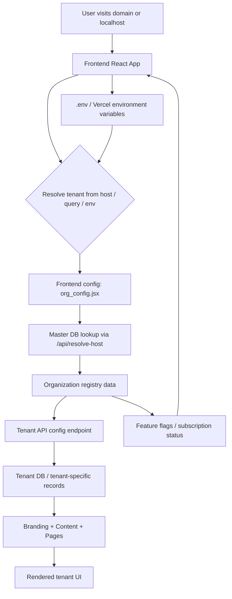

# Esport Team Architecture

This project is a multi-tenant esports web application with a Django backend and a Vite + React frontend.

## 1. Project Overview

The repository is split into two main parts:

- Frontend: React app for the public site and tenant branding
- Backend: Django REST API with separate master and tenant database setup

The application is designed so each organization/tenant can have:

- its own branded frontend configuration
- its own tenant database for tenant-specific content
- a shared master database for organization metadata and tenant lookup

---

## 2. Folder Structure

```text
Esport_TEAM/
├── Backend/
│   ├── api/
│   ├── Backend/
│   ├── Client/
│   ├── Master/
│   ├── manage.py
│   ├── requirements.txt
│   ├── master.sqlite3
│   ├── tenant.sqlite3
│   └── ...
├── Frontend/
│   ├── src/
│   ├── public/
│   ├── package.json
│   ├── vite.config.js
│   ├── .env
│   └── ...
├── ARCHITECTURE.md
├── CMD.md
├── README.md
└── ...
```

---

## 3. Backend Architecture

### 3.1 Master Database

The master database stores shared organization-level information such as:

- tenant slug
- organization domain
- API URL
- subscription tier
- tenant status
- feature flags

This is used to resolve which tenant should be served based on the current hostname or subdomain.

Main files:

- `Backend/Master/models.py`
- `Backend/Master/views.py`
- `Backend/Master/serializers.py`
- `Backend/Master/admin.py`

### 3.2 Tenant Database

The tenant database stores tenant-specific content, usually business data like:

- organization content
- hero/about/gallery/team/events
- brand-related settings for each tenant

Main files:

- `Backend/Client/models.py`
- `Backend/Client/views.py`
- `Backend/Client/serializers.py`
- `Backend/Client/admin.py`

### 3.3 Router Strategy

The backend uses database routing so the app can decide which database to use depending on the request or tenant context.

Relevant files:

- `Backend/Client/routers.py`
- `Backend/Master/routers.py`
- `Backend/Backend/settings.py`

This allows multi-tenant separation without mixing tenant data in the same database.

---

## 4. Frontend Architecture

The frontend is a Vite React application.

### Key responsibilities

- detect current host / subdomain
- resolve the matching tenant
- fetch branding config from the backend
- inject colors and organization information into the app
- render tenant-specific pages and assets

Important frontend files:

- `Frontend/src/config/org_config.jsx`
- `Frontend/src/config/env_export.js`
- `Frontend/src/home/Home_API_Fetches.jsx`
- `Frontend/src/home/Home_API_Provider.jsx`
- `Frontend/src/App.jsx`

### Tenant resolution flow

The frontend currently tries to resolve the current tenant in this order:

1. query param such as `?tenant=t2k`
2. environment override such as `VITE_DEMO_TENANT`
3. hostname / subdomain detection
4. configured default tenant from `.env`
5. fallback OPTECH values if no tenant is found

This is why local development with ports like `5173`, `5174`, and `5175` can work differently from production domains such as:

- `t2kesport.vercel.app`
- `drsesport.vercel.app`
- `aslesport.vercel.app`

---

## 5. System Design Architecture

### High-level system design



### Request and data flow

1. The user loads a URL such as:
   - `http://localhost:5173`
   - `https://t2kesport.vercel.app`
   - `https://drsesport.vercel.app`
2. The frontend reads the current host, query string, and environment variables.
3. `org_config.jsx` resolves the active tenant slug.
4. Frontend sends tenant context to the backend using `slug` and `host` values.
5. The backend uses the master database to find the matching organization.
6. The backend returns tenant config, branding, and feature flags.
7. Frontend fetches content from the tenant database or the resolved tenant API.
8. The page is rendered using the tenant-specific data and colors.

### Example request lifecycle

```text
Browser
  -> Frontend loads
  -> detect host = t2kesport.vercel.app
  -> resolve slug = t2k
  -> GET /api/resolve-host?host=t2kesport.vercel.app
  -> Master DB returns organization record for slug t2k
  -> GET /api/config?host=t2kesport.vercel.app&slug=t2k
  -> Tenant API returns branding/content metadata
  -> Frontend renders tenant-specific page
```

---

## 6. Database Setup

The project uses two SQLite databases:

- `Backend/master.sqlite3` — shared master data
- `Backend/tenant.sqlite3` — per-tenant data

These are configured in Django settings.

Use commands like:

```bash
py manage.py migrate --database=master
py manage.py migrate --database=tenant
```

If you are working with the default database setup, ensure the database router and settings are applied correctly before running migrations.

---

## 7. Environment Configuration

### Frontend env file

File:

- `Frontend/.env`

Important variables:

```env
VITE_USE_DEMO=false
VITE_DEFAULT_TENANT_SLUG=abc
VITE_MASTER_API_URL=https://esport-team-backend.vercel.app/api
VITE_BACKEND_URL_PRODUCTION=https://esport-team-backend.vercel.app/api
VITE_BACKEND_URL_DEVELOPMENT=http://127.0.0.1:8000/api
```

These values are used for tenant detection, API routing, and fallback branding.

### Vercel env variables

When deploying to Vercel, set the same env variables in the Vercel project settings. Local `.env` files do not get applied automatically to production deployments.

---

## 8. Local Development Workflow

### Start backend

```bash
cd Backend
py manage.py runserver 0.0.0.0:8000
```

### Start frontend

```bash
cd Frontend
npm install
npm run dev -- --host 0.0.0.0
```

Common local ports:

- 5173
- 5174
- 5175

These can be used to test different tenants locally.

---

## 9. Tenant User Management Commands

The project includes custom Django management commands for creating, deleting, and managing tenant users.

You can find them here:

- `Backend/Client/management/commands/create_tenant_user.py`
- `Backend/Client/management/commands/delete_tenant_user.py`

These commands are meant to simplify user setup for tenant-specific organizations.

---

## 10. Common Contributor Notes

- Always check `.env` values before debugging tenant issues
- Confirm which database is being used before migrating or creating users
- For tenant-specific work, verify subdomain/hostname matching in the frontend config
- For production deployment, always set Vercel env variables separately
- Keep the master DB and tenant DB separate and intentional

---

## 11. Recommended contributor checklist

Before starting work:

```bash
cd Backend
py manage.py migrate --database=master
py manage.py migrate --database=tenant
```

If creating a user:

```bash
py manage.py create_tenant_user
```

If deleting a user:

```bash
py manage.py delete_tenant_user
```

Then start the frontend:

```bash
cd Frontend
npm run dev -- --host 0.0.0.0
```

---

## 12. Summary

This application is built around a shared master database + separate tenant databases model. The frontend resolves tenant data dynamically from hostnames and environment config, while the backend keeps the organization metadata and database separation logic centralized.

This architecture allows a single codebase to serve multiple brand experiences while keeping each tenant isolated.

---

## 13. Contributor Mental Model

Think of the system like this:

- Master database = customer registry / domain resolver
- Tenant database = individual tenant content
- Frontend = decision layer + presentation layer
- Backend API = bridge between frontend and database layer

If a tenant is not matching correctly, check these in order:

1. Current host / URL
2. `.env` values
3. frontend resolver in `org_config.jsx`
4. backend master lookup in `Master/views.py`
5. tenant data in the tenant database

This is the fastest path to diagnosing routing, branding, and content mismatch issues.
